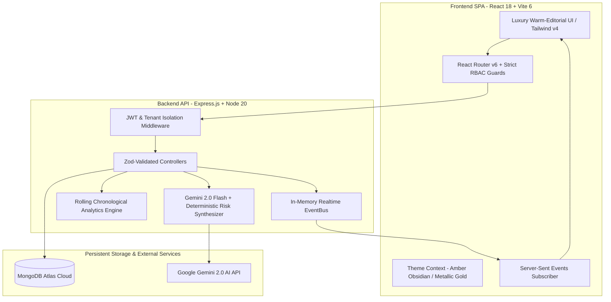

# EventForge 🌟
### Enterprise Multi-Track Conference & Live Event Operating System

[](https://nodejs.org/)
[](https://reactjs.org/)
[](https://vitejs.dev/)
[](https://www.mongodb.com/)
[](https://tailwindcss.com/)
[]()

> **EventForge** is a production-grade, real-time AI operating system for planning, operating, and analyzing conferences and live summits. It unifies attendee registration, multi-track agendas, QR badge generation, offline-capable gate check-in, real-time telemetry streaming, deterministic risk detection, evidence-backed AI recommendations with human-in-the-loop approval, and executive post-event intelligence.

---

## 🧭 Live Demo Quick Access (One-Click Personas)

The application includes an instant **One-Click Persona Matrix** on the login page (`/login`) pre-seeded with 5 distinct test accounts:

| Persona | Name | Email | Password | Role & Scope |
| :--- | :--- | :--- | :--- | :--- |
| 🛡️ **Platform Admin** | Platform Administrator | `admin@eventforge.com` | `Admin123!` | System-wide oversight, event approvals, user audits, Inbound CRM inquiries. *(Read & Governance only; pass purchase disabled)* |
| 👑 **Lead Organizer (A)** | Marcus Vance | `marcus.organizer@eventforge.com` | `Organizer123!` | Manages **Global AI Summit 2026** (3 Tracks, 10 Sessions), ticketing, stage run-of-show, live pulse, and dynamic analytics. |
| 🚀 **Co-Organizer (B)** | Sarah Chen | `sarah.organizer@eventforge.com` | `Organizer123!` | Manages **FinTech & Web3 Expo 2026**, separate tenant isolation, independent session agendas & staff. |
| 📱 **Door Staff** | Alex Rivera | `alex.staff@eventforge.com` | `Staff123!` | High-velocity gate scanner, offline badge verification with queued local sync, badge lookup. |
| 🎟️ **Executive Attendee**| Dr. Elena Rostova | `elena.attendee@eventforge.com` | `Attendee123!` | Multi-event pass registration, dynamic PDF badge print with QR code, personal schedule bookmarks. |

---

## 🏛️ System Architecture



---

## ⚡ Core Platform Capabilities

### 1. Dynamic Single-Event Analytics Graph & Telemetry
- **Single-Event Focus**: Dedicated dropdown selector enables organizers to inspect performance metrics for individual summits.
- **Chronological Rolling Multi-Day Curves**: Derives dynamic date-stamped curves (`Sep 19` → `Today`) directly from database registrations and ticket transactions.
- **Micro-Formatted Precision Axes**: Compact margins, zero-gap axis labeling, and currency formatters provide high-density financial and registration telemetry.

### 2. Role-Aware Event Directory (`/explore`)
- **Organizer Workspace Links**: When an organizer browses public conferences, their own published summits feature a direct **`Manage Event`** button linking to their management suite.
- **External Events Delegate Access**: Conferences owned by other organizations dynamically display **`Secure Passes`** / **`View Passes`**.
- **Admin Governance Guard**: Platform admins have instant audit inspection without pass reservation clutter.

### 3. Live Event Pulse & Room Congestion Intelligence
- **Weighted Health Index (0–100)**: Real-time explainable metric aggregating:
  - *Attendance Velocity (25%)* vs expected arrival curve
  - *Room Capacity Headroom (25%)* and overflow risk
  - *Multi-Track Flow (20%)* and speaker schedule pacing
  - *Door Velocity (15%)* badge scans per minute
  - *Session Demand Index (15%)*
- **Server-Sent Events (SSE)**: Zero-refresh telemetry stream updates organizers on badge scans, capacity warnings, and schedule announcements in real time.

### 4. Evidence-Backed AI Recommendations & Human-in-the-Loop Actions
- AI never silently modifies critical event parameters.
- Room congestion risks compile mathematical proof (occupancy percentage, overflow counts, comparative hall availability).
- Proposes actionable mitigations (`MOVE_SESSION`, `OPEN_OVERFLOW_ROOM`, `BROADCAST_ANNOUNCEMENT`, `REASSIGN_STAFF`).
- **One-Click Execution**: Organizers review and approve mitigations with atomic database updates and instant SSE broadcast.

### 5. High-Velocity Offline-Capable Door Check-In Scanner
- **Dual-Mode Scanner**: Operates seamlessly in online and offline conditions.
  - **Online Mode (🟢)**: Direct server validation and instant badge authorization.
  - **Offline Mode (🟠)**: Locally stores scanned badge tokens with queued status and enables one-click batch synchronization upon reconnection.

### 6. Digital QR Badges & Pass Management
- **Instant Digital Badge**: Attendees receive print-ready badges with embedded QR tokens, organization branding, VIP access ribbons, and session agendas.
- **Atomic Category Allocations**: Prevents overselling with database-level atomic operations and automated waitlist promotion.

### 7. Dual Administrative Portals
- **Admin Console (`/dashboard/admin`)**: Global system metrics, event publishing approvals, and user audit rosters.
- **Inbound Lead CRM (`/dashboard/admin/inquiries`)**: Separate dedicated portal for enterprise sales inquiries, sponsorship requests, and enterprise contact triage.

### 8. Post-Event AI Intelligence Dossier
- Generates executive summaries of peak hall utilization, show-up rates, revenue breakdown, and actionable AI takeaways for future summits.

---

## 📡 Backend API Reference

### Authentication & Profiles
| Method | Endpoint | Description | Access |
| :--- | :--- | :--- | :--- |
| `POST` | `/api/auth/register` | Register new user (Attendee or Organizer) | Public |
| `POST` | `/api/auth/login` | Authenticate and receive JWT | Public |
| `GET` | `/api/auth/me` | Fetch current session profile | Authenticated |
| `GET` | `/api/auth/users` | List system users (audits & staff assignment) | Admin / Organizer |

### Events & Multi-Track Conferences
| Method | Endpoint | Description | Access |
| :--- | :--- | :--- | :--- |
| `GET` | `/api/events` | List all published events (supports search & filter) | Public |
| `POST` | `/api/events` | Create new conference | Organizer / Admin |
| `GET` | `/api/events/:id` | Get event details with tracks and tickets | Public |
| `PUT` | `/api/events/:id` | Update conference details and schedule | Event Owner / Admin |
| `DELETE` | `/api/events/:id` | Delete or archive conference | Event Owner / Admin |

### Registrations & Badges
| Method | Endpoint | Description | Access |
| :--- | :--- | :--- | :--- |
| `POST` | `/api/events/:id/register` | Secure passes (atomic category decrement) | Authenticated |
| `GET` | `/api/events/:id/attendees` | List registered attendees and check-in states | Event Owner / Staff |
| `POST` | `/api/events/:id/check-in` | Check in attendee by QR badge token | Door Staff / Organizer |
| `POST` | `/api/events/:id/waitlist/join`| Join category waitlist when sold out | Authenticated |

### Real-Time Intelligence & AI
| Method | Endpoint | Description | Access |
| :--- | :--- | :--- | :--- |
| `GET` | `/api/events/:id/intelligence/stream` | Server-Sent Events live telemetry stream | Event Owner / Staff |
| `GET` | `/api/events/:id/intelligence/health` | Calculate 0-100 real-time health score | Event Owner / Staff |
| `POST` | `/api/events/:id/intelligence/copilot`| Query live event AI Copilot | Event Owner / Admin |
| `POST` | `/api/events/:id/actions/:actionId/execute` | Approve & execute AI mitigation | Event Owner / Admin |

### Inquiries & CRM
| Method | Endpoint | Description | Access |
| :--- | :--- | :--- | :--- |
| `POST` | `/api/inquiries` | Submit public enterprise contact form | Public |
| `GET` | `/api/inquiries` | List enterprise inbound leads | Platform Admin |
| `PATCH` | `/api/inquiries/:id` | Update inquiry status (`REVIEWED`, `RESOLVED`)| Platform Admin |

---

## 🛠️ Local Development Setup

### Prerequisites
- **Node.js**: v20.x or later
- **npm**: v10.x or later
- **MongoDB Atlas** or local MongoDB instance

### 1. Repository Clone & Setup
```bash
git clone https://github.com/Tehnaaz-AI/event-forge.git
cd EventForge
```

### 2. Backend Setup
```bash
cd backend
npm install
```

Create `backend/.env`:
```env
PORT=3100
MONGODB_URI=your_mongodb_connection_string
JWT_SECRET=your_jwt_secret_key_here
JWT_EXPIRES_IN=8h
CLIENT_URL=http://localhost:5173

# Admin Setup
ADMIN_NAME=Platform Administrator
ADMIN_EMAIL=admin@eventforge.com
ADMIN_PASSWORD=Admin123!

# AI Copilot (Gemini API)
AI_PROVIDER=gemini
GEMINI_API_KEY=your_gemini_api_key
GEMINI_MODEL=gemini-2.0-flash
```

Seed Database with 5 Persona Demo Accounts:
```bash
npm run seed
```

Start Backend Server:
```bash
npm run dev
```
*Backend runs on `http://localhost:3100` (Health Check: `http://localhost:3100/api/health`)*

### 3. Frontend Setup
```bash
cd ../frontend
npm install
```

Create `frontend/.env`:
```env
VITE_API_URL=http://localhost:3100/api
```

Start Frontend Dev Server:
```bash
npm run dev
```
*Frontend runs on `http://localhost:5173`*

### 4. Running Automated Tests
```bash
cd ../backend
npm test
```

### 5. Production Build
```bash
cd ../frontend
npm run build
```

---

## 🔒 Security & Data Integrity

1. **Role-Based Access Control (RBAC)**: Strictly enforced at route and controller layers with JWT validation (`PLATFORM_ADMIN`, `ORGANIZER`, `STAFF`, `ATTENDEE`).
2. **Tenant Isolation**: Organizers can only inspect and mutate events where `event.organizer === user._id` or matching organization scope.
3. **Atomic Inventory Control**: Ticket capacity uses MongoDB atomic operations (`$inc`, `$pull`) with optimistic concurrency checks to prevent overselling.
4. **Offline Scanner Security**: Offline scan payloads are cryptographically hashed and validated during reconciliation.
5. **AI Guardrails**: AI suggestions are deterministic with strictly typed Zod schemas, grounded solely on live database telemetry without hallucinatory assumptions.

---

## 📄 License
This project is open-source and available under the [MIT License](LICENSE).
